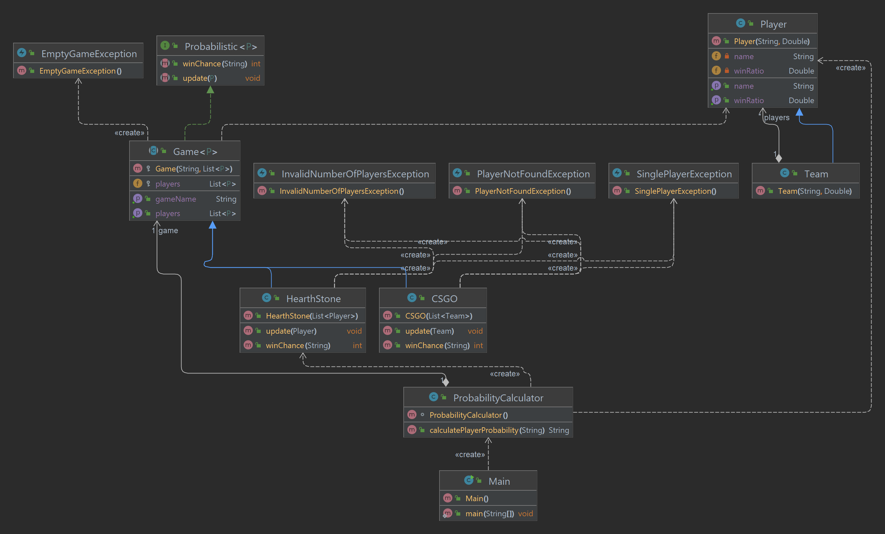

# Propósito do projeto

# Participantes
Bruno da Fonseca Dumaresq
# Organização do projeto com o respectivo diagrama de classes



 * Exceptions: É onde estão as classes de excessão do programa.
 * Game: É onde estão as abstrações e implementações dos jogos.
 * Player: É onde está a classe base Player e quem herda dele.
 * Java: Classe primária é onde está o ProbabilityCalculator e o ponto de entrada da execução (Main)
  
O ProbabilityCalculator aceita qualquer tipo de jogo que extenda de Game e tem implementado metodos da interface Probabilistic

Tendo os métodos da interface implementado o ProbabilityCalculator consegue calcular automaticamente a probabilidade de um jogador ganhar o jogo.

Ao invés de jogador pode ser passado qualquer objeto que extenda de Player, como por exepmplo um time bastando que ele extenda da classe Player dessa forma agora podemos ter jogo de times ao invés de um jogo de n jogadores.


# Instruções de como realizar o build

 Necessário possuir java 17 e maven.

 Caso esteja utilizando alguma IDE, basta importar o projeto maven que tudo será automaticamente configurando

 para buildar pelo terminal, estando com o maven instalado basta executa os comando:
 ``mvn package``
    
# Instruções de como executar

 Necessário possuir java 17 e maven.

 Caso esteja utilizando alguma IDE, basta importar o projeto maven que tudo será automaticamente configurando

 para executar pelo terminal, estando com o maven instalado basta executa os comando:
````
    mvn package
    java -cp target/probability-1.0-SNAPSHOT.jar Main
````
    